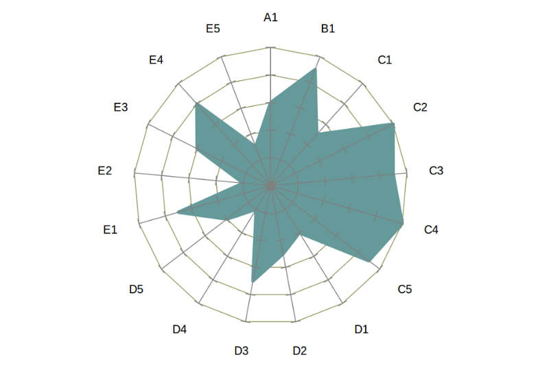
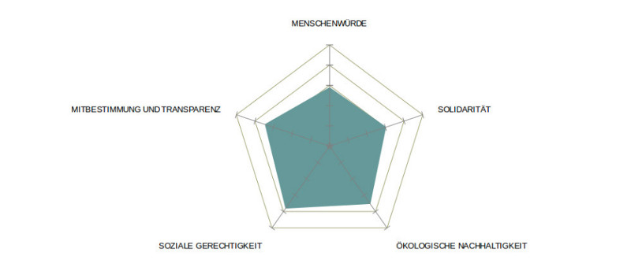
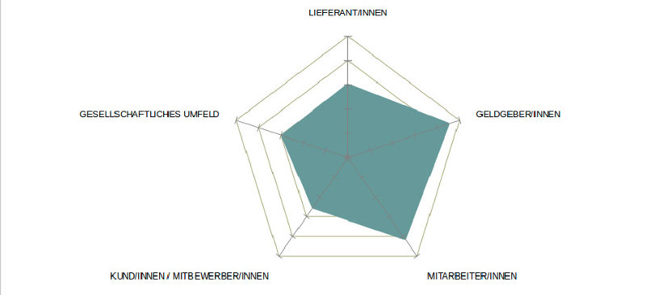

Die Gemeinwohlbilanz ist das "Herzstück" der [Gemeinwohl-Ökonomie][gwö]. Sie stellt den Menschen und alle Lebewesen sowie das 
Gelingen der Beziehungen zwischen ihnen in den Mittelpunkt des Wirtschaftens. Sie überträgt die heute schon gültigen Beziehungs- und Verfassungswerte auf den Markt, indem sie die WirtschaftsakteurInnen dafür belohnt, dass sie sich human, wertschätzend, kooperativ, solidarisch, ökologisch und demokratisch verhalten und organisieren. Sie macht die Werte der Gesellschaft zu den Werten der Wirtschaft.<a href="#sup1">1</a>

# Gemeinwohlbilanz 2014 der sinndrin genossenschaft

## Allgemeine Infos

* Stand: Geschäftsjahresabschluss 2014
* Firmenname: sinndrin genossenschaft
* Eigentums- und Rechtsform, Eigentumsanteile: Genossenschaft
* Branche: Nachhaltigkeit
* Anzahl der MitarbeiterInnen: 6 Personen mit insgesamt 2’500 Arbeitsstunden
* Umsatz: CHF 390’000.-
* Bruttolohnsumme: CHF 59’000.-
* Gewinn: CHF 0.-
* Sitz: Zunstrasse 11, CH-8152 Glattbrugg
* Web: www.sinndrin.ch
* Berichtszeitraum: Zeitraum für den der Bericht erstellt wurde

## Tätigkeitsbereich
Die sinndrin genossenschaft ist ein auf Nachhaltigkeit ausgerichtetes Team von Ingenieuren.
Unsere Vision ist es sinnstiftende Projekte umzusetzen, die der Gesellschaft von Nutzen sind. Dabei sind wir offen für alle 
Projekte die unseren Grundsätzen folgen. Die stetige Weiterentwicklung der Genossenschaft und ihrer Mitarbeitenden ist uns 
wichtig, weshalb wir auch an der Bearbeitung neuer Themenbereiche interessiert sind.

Wir fördern Bestrebungen zu Nachhaltigkeit, Umweltverträglichkeit, Fairness, Transparenz, Partizipation, persönlichem Wachstum
und Gesundheit bei Einzelnen, Gruppierungen, in der Wirtschaft, dem Staat und der Gesellschaft. 

Unseren Beitrag dazu leisten wir in den Feldern der Planung, Umsetzung, Begleitung, Bildung, Beratung, Information, 
Intervention, Forschung, Produktion und Handel. Die GenossenschafterInnen bauen die Infrastruktur und das Wissen auf, 
um in den obengenannten Feldern die Bestrebungen der Genossenschaft zu erreichen. Dazu betreibt die Genossenschaft eine 
Planungs-, Ausführungs-, Beratungs-, Interventions- und Dokumentationsstelle.

Neben der Realisierung von Projekten bieten wir eine Plattform für Menschen die nach den Grundsätzen der Genossenschaft 
Aufträge und Projekte verwirklichen wollen.

|Produkte/ Dienstleistungen|Anteil an der Bruttolohnsumme|
|--------------------------|-----------------------------|
|Diverse Nischen bedienen|5%|
|Fairphone Vertrieb|20%|
|Fairphone Support|5%|
|Reparaturen von elektronischen Geräten|10%|
|3D-Druck|1%|
|Bildungsinterventionen im erweiterten Nachhaltigkeitsbereich|20%|
|Energieanzeigen planen und realisieren|10%|
|Fachbücherbörse|10%|
|Unternehmensberatung|10%|
|Webdesign|5%|
|Bio-Lebensmittelhandel|4%|

## Das Unternehmen und Gemeinwohl
Die sinndrin genossenschaft ist bestrebt eine Gesellschaftsform mitzugestalten, die die Ressourcen künftiger Generationen 
nachhaltig nützt und vor Raubbau, Vergiftung, und Zerstörung schützt. Die Gemeinwohl-Ökonomie bringt unsere gesellschaftlichen 
Bestrebungen mit unserem wirtschaftlichen Tun in Einklang. Mit der Gemeinwohlbilanz haben wir ein Werkzeug in die Hand bekommen,
das uns strukturiert den Handlungsspielraum aufzeigt, um eine Gesellschaftsform zu fördern die unseren Vorstellungen entspricht.

Ansprechperson: [Raphael Hagmann][Raphael]

Wir stehen in Kontakt mit der Regionalgruppe GWÖ-Luzern. Kontaktperson: Ralf Nake vom Terra Institut r.nacke@terra-institute.eu

## Selbsteinschätzung, Negativkriterien und Resultat

 

 

 

|Indikator|Selbst-Einschätzung (%)|
|---------|-----------------------|
|A1 - Ethisches Beschaffungsmanagement|60 %|
|B1 - Ethisches Finanzmanagement|90 %|
|C1 - Arbeitsplatzqualität und Gleichstellung|50 %|
|C2 - Gerechte Verteilung der Erwerbsarbeit|100 %|
|C3 - Förderung ökologischen Verhaltens der Mitarbeitenden|90 %|
|C4 - Gerechte Einkommensverteilung|100 %|
|C5 - Innerbetriebliche Demokratie und Transparenz|90 %|
|D1 - Ethische Kundenbeziehung|40 %|
|D2 - Solidarität mit Mitunternehmen|50 %|
|D3 - Ökologische Gestaltung der Produkte und Dienstleistungen|70 %|
|D4 - Soziale Gestaltung der Produkte und Dienstleistungen|20 %|
|D5 - Erhöhung der sozialen und ökologischen Branchenstandards|40 %|
|E1 - Sinn und gesellschaftliche Wirkung der Produkte/ DL|70 %|
|E2 - Beitrag zum Gemeinwesen|20 %|
|E3 - Reduktion ökologischer Auswirkungen|60 %|
|E4 - Gemeinwohlorientierte Gewinnverwendung|80 %|
|E5 - Gesellschaftliche Transparenz und Mitbestimmung|30 %|
|Bilanzsumme Total:|65 %|

## Negativkriterien
Hiermit bestätigt die sinndrin genossenschaft, dass wir keines der Negativkriterien erfüllen.

|Negativkriterium|Kann ich bestätigen|Kann ich nicht bestätigen|
|----------------|-------------------|-------------------------|
|Keine Verletzung der ILO-Arbeitsrechtenormen/ Menschenrechte|X| |
|Keine Menschenunwürdigen Produkte|X| |
|Keine Beschaffung bzw. Kooperation mit Unternehmen, welche die Menschenwürde verletzen|X| |
|Keine feindliche Übernahme|X| |
|Keine Sperrpatente|X| |
|Keine Dumpingpreise|X| |
|Keine illegitimen Umweltbelastungen|X| |
|Keine Verstöße gegen Umweltauflagen (z.B. Grenzwerte)|X| |
|Keine geplante Obsoleszenz|X| |
|Kein Arbeitsrechtliches Fehlverhalten seitens des Unternehmens|X| |
|Kein Arbeitsplatzabbau oder Standortverlagerung trotz Gewinn|X| |
|Keine Umgehung der Steuerpflicht|X| |
|Keine unangemessene Verzinsung für nicht mitarbeitende Gesellschafter|X| |
|Offenlegung aller Beteiligungen und Tochterunter-nehmen|X| |
|Keine Verhinderung eines Betriebsrates|X| |
|Offenlegung aller Finanzflüsse an Lobbyisten und Eintragung ins Lobbyregister der EU|X| |
|Keine Exzessive Einkommensspreizung|X| |

## Genaue Beschreibung der einzelnen Kriterien
### A1 Ethisches Beschaffungsmanagement
Das Beschaffungswesen ist verschieden aufgebaut. Bei Softwareprodukten wird wenn möglich auf Open-Source gesetzt. Auf 
materieller Ebene (Büromaterial wie Papier, Elektronik und IT) sind die Ausgaben gering, da kein grossen Mengen benötigt 
werden oder Secondhand-Produkte sehr günstig beschafft werden können. Bei der Beschaffung von Dienstleistungen wie 
Bankgeschäften und Versicherungen sind die Beträge höher. Darum wurde bei der Auswahl der Lieferanten speziell auf Ökologie 
und Ethik geachtet.

#### A1.1 Berücksichtigung regionaler, ökologischer und sozialer Aspekte bzw. höherwertiger Alternativen
* Eigeneinschätzung: 50% (Erfahren)

**Ausgaben der sinndrin genossenschaft**

|Ausgabenposten + % der Ausgaben|Erläuterung und (soziale, ökologische, regionale) Bewertung|
|-------------------------------|-----------------------------------------------------------|
|Miete| (0% zur Zeit gratis)|Norm Wohnungsbau 1980|
|Energie/ Strom (0% gratis)|100% Ökostrom|
|Technik Hard-/Software (0%)|keine aktuellen Anschaffungen, alles Open-Source Software|
|Büromaterial (100%)|Recycling (wenn möglich) aus Europa|

Wir haben zur Zeit keine Anschaffungen getätigt, da wir allgemein versuchen unser Konsumverhalten gering zu halten. Wenn 
irgendwie möglich, verwenden wir für unsere Software Open-Source Produkte. Da bei Open-Source Produkten die geleistete Arbeit 
auf freiwilliger Basis entsteht, gehen wir davon aus, dass dies eine ethische Form von Materialbeschaffung ist.

#### A1.2 Aktive Auseinandersetzung mit den Risiken zugekauften P/D und Prozesse zur Sicherstellung
* Eigeneinschätzung: 65% (Vorbildlich)

Als relativ kleines Unternehmen verfügt die sinndrin genossenschaft über keine systematischen Erfassungssysteme oder offizielle 
Schreiben bezüglich eines ethischen Beschaffungswesens. Wir schauen bei unseren Produkten aber trotzdem auf deren Herkunft und 
oder die Label-Zertifizierung (beachtete Label unter D5.1). Uns sind keine ethisch höher gewichteten Alternativprodukte bekannt,
die anstelle der aktuell konsumierten erhältlich sind.

#### A1.3 Strukturelle Rahmenbedingungen zur fairen Preisbildung
* Eigeneinschätzung: 65% (Vorbildlich)

Bei der Wahl der Versicherung wurde ein günstigeres Angebot abgelehnt zu Gunsten eines ethisch höher gewichteten (es wurde auf 
die genossenschaftliche Firmenstruktur geachtet). Auch bei der Wahl der Bank wurde auf monetäre Vorteile zu Gunsten höherer 
sozialer und ökologischer Werte verzichtet. Geschätzt macht dies bei den erwähnten Beschaffungen 10% höher Kosten aus. Die 
Spielräume für höherwertige Beschaffungen entstehen durch eine bewusst reduzierte Erwartungshaltung auf Gewinne.

### B1 Ethisches Finanzmanagement
Wir achten auf ethisch-nachhaltige Finanzdienstleister und zahlen weder für das Eigenkapital noch für das Fremdkapital Zinsen. 
Auf dies Weise versuchen wir dem Zinseszins Effekt und dem daraus resultierenden Wachstumszwang entgegen zu wirken.

#### B1.1 Institutionalisierung
* Eigeneinschätzung: 90% (vorbildlich)

Die Alternative Bank Schweiz ABS ist seit 2013 unsere Bank. Sie investiert ausschliesslich  in soziale und ökologische Projekte.
Auch wirtschaftet sie transparent, was sie für uns zum optimalen Finanzpartner macht. In den Stauten der sinndrin ist verankert,
dass wir nur mit ethisch passenden Institutionen zusammen arbeiten möchten. 

#### B1.2 Ethisch-nachhaltige Qualität des Finanzdienstleisters
* Eigeneinschätzung: 100% (Vorbildlich)

Wir arbeiten mit der Alternativen Bank Schweiz ABS zusammen. Beiträge für die Vorsorgekasse zahlen wir bei der Nest 
Sammelstiftung ein. Die Nest investiert nach ökologisch und ethischen Richtlinien und ist Mitglied bei Swiss Sustainable 
Finance und PRI (Principles for Responsible Investment). Beide Institutionen sind bekannt dafür, dass sie ethisch nachhaltige 
Finanzdienstleister sind. Bis jetzt haben wir alle Investitionen über Eigenkapital oder zinslose Darlehen bewältigen können.

#### B1.3 Gemeinwohlorientierte Veranlagung
* Eigeneinschätzung: 90% (Vorbildlich)

Unsere Kapital wird nicht verzinst (zur Zeit sogar Minus Zinsen) und ist darüber hinaus voll und ganz in ethisch-nachhaltigen 
Projekten investiert. Dies garantiert uns das Finanzmanagement der Alternativen Bank Schweiz und unser eigene Angebots Pallete.

#### B1.4 Gemeinwohl orientierte Finanzierung
* Eigeneinschätzung: 90% (vorbildlich)

**Auflistung Eigen- und Fremdkapital-Anteil**

* Eigenkapital: 25%-Anteil Gesamtkapital
* Fremdkapital: 75%-Anteil Gesamtkapital

Unser Fremdkapital stammt voll umfänglich aus dem Netzwerk (Verwandte und Bekannte). Das Fremdkapital (Darlehen) sowie das 
Eigenkapital (Genossenschaftsanteilsscheine) werden nicht verzinst.

### C1 Arbeitsplatzqualität und Gleichstellung
Die sinndrin genossenschaft verfügt im Bereich der Lohngleichheit (gleiche Entlohnung für gleiche Arbeit) sowie bei der 
Mitbestimmung der Mitarbeitenden über praxistaugliche Konzepte ,die erfolgreich angewandt werden. Noch Handlungsbedarf besteht 
in den Bereichen der Integration von Personen mit Handicap, Durchmischung der Geschlechter und Kulturen sowie bei der 
gesundheitlichen Absicherung der Mitarbeitenden.

Allgemeine Beschreibung der Mitarbeitenden:

Die sinndrin genossenschaft hat mit sechs Personen einen Arbeitsvertrag. Die Arbeitsverträge sind identisch und laufen auf 
Stundenlohnbasis. Zur Zeit sind alle Arbeitnehmenden männlich, dieser Umstand ist jedoch nicht befriedigend. Es gibt keine 
Personen mit Handicap und nur eine Hierarchiestufe.

#### C1.1 Mitarbeiter Orientierte Organisationskultur und -strukturen
* Eigeneinschätzung: 60% (Erfahren)

In der sinndrin genossenschaft gibt es keine Hierarchieebenen. Ideal typisch arbeiten alle Mitarbeitenden selbständig und 
können im Team immer nach Kompetenzen fragen. Es wird wieder vermehrt versucht, Arbeiten in Gruppen oder im Plenum zu 
bearbeiten, da dies mehr Freude bereitet und nicht zwangsweise ineffizienter ist.

Grundsätzlich gibt es in der sinndrin genossenschaft eine Informations Hol- Bringschuld. Dies heisst, jeder ist selbst 
verantwortlich, inwiefern man über das tägliche Geschäft informiert ist. Um die Informationsbeschaffung zu erleichtern, werden 
Protokolle geführt, to do-Listen erstellt oder das Betriebsreglement aktuell gehalten. Für NeueinsteigerInnen gibt es noch 
keinen geregelten Prozess bei der Integration in die Genossenschaft, dies hat auch schon zu Unklarheiten und Unsicherheiten 
geführt.

Die sinndrin genossenschaft kennt keine klar ausformulierten Förderprogramme für Mitarbeitende und deren Weiterbildung. Die 
sinndrin genossenschaft ist jedoch bestrebt das persönliche Wachstum der Mitarbeitenden zu fördern. Wegen nicht vorhandenen 
Hierarchiestufen ist keine Karriere im klassischem Sinne möglich. Allerdings steht es den Mitarbeitenden frei sich neuen 
Themenfelder oder Aufgaben zu widmen. Auf Grund des kleinen Teams ist eine Wöchentliche Sitzung mit allen Beteiligten möglich. 
So kann sich jeder in den Entscheidungsprozess einbringen. Lehrstellen oder andere Ausbildungsplätze werden nicht angeboten. 
Es besteht aber ein Interesse daran Lehrstellen einzurichten wenn eine Vollzeitbetreuung möglich und andere Bedingungen erfüllt 
sind.

#### C1.2 Faire Beschäftigungs- und Entgeltpolitik
* Eigeneinschätzung: 80% (Vorbildlich)

Wie hoch und auf welche Art Arbeit entlohnt wird, ist im Betriebsreglement genau beschrieben. Eine Diskussion über Änderungen
am Lohnsystem kann von allen jederzeit beantragt werden. Über Änderungen der Personalplanung sowie allgemeine 
Beschäftigungspolitik oder Sozialleistungen wird immer im Plenum (alle Beschäftigten) bestimmt. Somit wollen wir grösstmögliche
Transparenz und individuelle Mitbestimmung aller gewährleisten.

#### C1.3 Arbeitsschutz und Gesundheitsförderung einschließlich Work-Life-Balance/ flexible Arbeitszeiten
* Eigeneinschätzung: 30% (Fortgeschritten)

Alle Mitarbeitenden bestimmen selbst über die Anzahl geleisteter Stunden. Bei der sinndrin genossenschaft herrscht ein Klima 
der Selbstbestimmung. Dass die einzelnen Mitarbeitenden ihre Verantwortung gegenüber Kunden und anderen Mitarbeitenden 
wahrnehmen, wird vorausgesetzt. Die Nutzung von Home-Office ist verbreitet und akzeptiert.

Es werden keine Stunden bezahlt, die wegen Krankheit oder Unfall nicht geleistet werden können. Dies folgert aus dem 
Stundenlohn System. Noch sind keine Änderungen dieser Praxis angedacht.
Die Arbeitsplätze sind durch die Mitarbeitenden selbst einzurichten. Die sinndrin genossenschaft beteiligt sich nur in 
Ausnahmefällen an den Kosten für die Büroeinrichtung. Die Büroflächen werden in naher Zukunft rollstuhlgängig sein und somit
auch barrierefrei für Menschen mit Behinderung. Auch sind in den neuen Räumlichkeiten Entspannungszonen vorgesehen.

#### C1.4 Gleichstellung und Diversität
* Eigeneinschätzung: 30% (Fortgeschritten)

Bei der sinndrin genossenschaft sind alle Mitarbeitenden männlich. Dieser Umstand ist nicht aktiv gefördert worden und ist so
auch nicht gewollt. Es werden aber keine Bestrebungen unternommen, die Situation zu ändern und eine höhere Durchmischung der
Geschlechter zu erreichen. Auch bei der Altersdurchmischung oder kulturellen Vielfalt liegt  die sinndrin genossenschaft mit
hoher Wahrscheinlichkeit unter dem Branchendurchschnitt. Auch hier wird nichts dagegen unternommen, die Situation wird jedoch
nicht als störend empfunden.

Auf Grund der geringen Betriebsgrösse werden keine Anti- Diskriminierungsmassnahmen durchgeführt. Jede Woche wird der Lösung
allfälliger zwischenmenschlicher Konflikte Raum geboten.

### C2 Gerechte Verteilung der Erwerbsarbeit
Die sinndrin genosseschaft ist bestrebt, den Mitarbeitenden die volle Freiheit zu lassen wann und wie viel sie arbeiten wollen.
Es herrscht eine Akzeptanz, dass Arbeitszeit und Freizeitgestaltung sowie deren zeitliche Aufteilung individuellen Bedürfnissen
folgt und dass die sinndrin genossenschaft diesen auch gerecht werden soll.

#### C2.1 Senkung der Normalarbeitszeit
* Eigeneinschätzung: 100% (Vorbildlich)

* Durchschnittliche Arbeitszeit je Beschäftigtem: 35%-Pensum
* Geleistete Überstunden je Mitarbeitende: Keine, die Überzeit gibt es statistisch nicht, da keine Arbeitsverträge mit 
festgelegten Stellenprozenten existieren.

Die sinndrin genossenschaft bezahlt die Mitarbeitenden nach geleisteten Stunden. Wie viele Stunden und zu welcher Zeit die 
Arbeit geleistet wird, ist nicht genau definiert. Es ist den Mitarbeitenden überlassen ihr Arbeitsengagement festzulegen. Dies
ist das einzig existierende Arbeitszeitmodell. Alle Mitarbeitenden haben diesem Modell basisdemokratisch zugestimmt und für die
nahe Zukunft ihre Lohn- sowie Arbeitszeitsvorstellungen bei der Geschäftsleitung anbringen können. Jede Woche gibt es einen 
Fix-Termin, welcher, wenn irgend möglich, wahrgenommen werden soll. 

#### C2.2 Erhöhung des Anteils der Teilzeit-Arbeitsmodelle und Einsatz von Zeitarbeit
* Eigeneinschätzung: 100% (Vorbildlich)

* Zeitarbeitsquote: 0%
* Teilzeitquote: 100%

Die sinndrin genossenschat bietet nur Teilzeitstellen an. Die Pensen werden von den Mitarbeitenden selbst bestimmt. Dies 
geschieht aus der Überzeugung, dass die Arbeitnehmenden mit der Verantwortung gegenüber Terminen, Projekten, Kundinnen und 
Kunden selbst umzugehen wissen und keine vorgegebene Arbeitszeiten benötigen. Es gibt nur ein Lohnniveau (1:1) und alle 
Mitarbeitenden haben die selben Rechte und Pflichten. Die Geschäftsleitung verfügt über gleich viel Entscheidungsgewalt wie 
die anderen Mitarbeitenden. Jedoch verfügen ausschliesslich die Geschäftsleitungsmitglieder über eine Unterschriftberechtigung.

#### C2.3 Bewusster Umgang mit (Lebens-) Arbeitszeit
* Eigeneinschätzung: 100% (Vorbildlich)

Im Unternehmen herrscht überwiegend die Formel, dass jeder so viel arbeiten soll, wie er will und kann. Der bewusste und 
individuelle Umgang mit der Ausbalancierung zwischen Arbeitszeit und Lebenszeit ist im Unternehmen prioritär verankert.

### C3 Forderung und Förderung ökologischen Verhaltens der MitarbeiterInnen
Die Mitarbeitenden besitzen über breite Kenntnisse in verschiedenen Umweltbelangen und Handeln. Daher ist dies relativ 
ressourcenschonend. Dies zeigt die fast ausschliessliche Nutzung des ÖV und der Verzicht auf motorisierten Privatverkehr 
sowie die bewusst vegetarisch/vegane Ernährung in den Mittagspausen.

#### C3.1 Ernährung während der Arbeitszeit
* Eigeneinschätzung: 90% (Vorbildlich)

||Teilweise vegetarisch/vegan|Mehrheitlich veget./vegan|Überwiegend veget./vegan|Bio-Anteil (in%)|
|-------------------------------------------|---------------------------|-------------------------|------------------------|----------------|
|Angebote im Unternehmen (% uale Verteilung)| | |x|65%|
|Tatsächliches Verhalten der MA (% uale Verteilung)| | |x|65%|

Die Mitarbeitenden kochen und essen überwiegend zusammen und achten auf eine ausgewogene Ernährungsweise. Darum ist das 
betriebsinterne Verpflegungsangebot mit der tatsächlichen Verhaltensweise identisch. Die Ernährung ist fast ohne Ausnahme 
vegetarisch oder vegan. Die Lebensmittel sind grösstenteils aus der Region und haben Bioqualität. Den Mitarbeitenden ist 
bewusst, dass die Ernährung einer der Hauptproblematiken im Bereich der weltweiten Ressourcenschonung ist. Das neue Kaffee 
Konsumkonzept soll als Beispiel dienen für den ernst gemeinten Versuch der sinndrin genossenschaft, ihren Ressourcenverbrauch 
zu senken. Neu wird der Kaffee in Bohnen eingekauft und muss mit einer Handmühle gemahlen werden. Die längere Zubereitungszeit 
führt zu weniger, aber einem bewussteren Kaffeekonsum. Die Mitarbeitenden unterstützen dieses Projekt uneingeschränkt.

#### C3.2 Mobilität zum Arbeitsplatz
* Eigeneinschätzung: 100% (Vorbildlich)

||Gesamt KM für das Unternehmen|Durchschnittlich pro MA|
|----|----|----|
|Auto/ PKW einzeln|0 km|0 km|
|Car-Sharing|300 km|60 km|
|ÖPNV|200’000 km|40’000 km|
|Fahrrad/ Fuß|2’000 km|400 km|

Firmenintern gilt, dass auf den privaten Personenverkehr möglichst verzichtet werden sollte. Weiter werden keine Parkplätze 
zur Verfügung gestellt oder Kraftstoffzuschüsse bezahlt. Die flexiblen Arbeitszeiten sollen den Mitarbeitenden die Möglichkeit 
geben auch den Langsamverkehr zu benutzen.

#### C3.3 Organisationskultur, Sensibilisierung und unternehmensinterne Prozesse
* Eigeneinschätzung: 80% (Vorbildlich)

Da sich fast sämtliche Geschäftsprozesse auf Umweltschutzbelange beziehen, sind auch fast alle Weiterbildungen sensibilisierend
in Umweltbelangen. Grundsätzlich ist das Wissen der Mitarbeitenden bezüglich verschiedenster Umweltproblematiken 
überdurchschnittlich. Daraus entsteht eine gewisse “Umweltschutz-Selbstkontrolle” und positive Gruppendynamik.

### C4 Gerechte Verteilung des Einkommens
Die sinndrin genossenschaft ist bestrebt grösstmögliche Transparenz und Gerechtigkeit bei der Entlöhnung der geleisteten Arbeitsstunden zu schaffen. Dies setzt sie mittels einer 1:1 Lohnverteilung um.

#### C4.1 Innerbetriebliche Bruttoeinkommensspreizung im Unternehmen
* Eigeneinschätzung: 100 % Vorbildlich

Die sinndrin genossenschaft kennt nur eine Lohnstufe (1:1). Die eingesetzte Lebenszeit wird, unabhängig von Qualifikation und
Fähigkeiten, immer als gleich wertvoll betrachtet und deshalb auch gleich entlohnt.

#### C4.2 Mindesteinkommen
* Eigeneinschätzung: 100 % Vorbildlich

Der Schweizer Mindestlohn (zwischen 3’500.- und 4’000.-) kann und wird ausbezahlt. Je nach Geschäftserfolg wird den allen 
Mitarbeitern der gleiche Bonus ausbezahlt. 

#### C4.3 Transparenz und Institutionalisierung
* Eigeneinschätzung: 100 % Vorbildlich

Im Betrieb ist ein Maximallohn definiert, zudem gibt es nur eine Lohnstufe. Es herrscht klare Transparenz über die Spreizung
(0% Lohnunterschiede) und Maximalauszahlung. Die Errechnung des Gehaltes ist im Betriebsreglement festgelegt. Die endgültige
Höhe wird von der Generalversammlung bestimmt.

### C5 Innerbetriebliche Demokratie und Transparenz
Die sinndrin genossenschaft ist als basis-demokratische und transparente Gesellschaft konzipiert. Alle Mitarbeitenden können sich bei allen Entscheidungen einbringen und haben gleiche Entscheidungskompetenzen. Ihnen stehen auch alle geschäftlichen Dateien uneingeschränkt zur Verfügung. Zudem ist es gewünscht, dass alle Mitarbeitenden mindestens einen Genossenschaftsanteilsschein halten.

#### C5.1 Grad der Transparenz
* Eigeneinschätzung: 100% (Vorbildlich)

Die Datenspeicherung wir auf einem Cloud-Server gemacht. Auf diese Cloud haben alle aktiven Mitglieder Zugriff, auch sind keine
Dateien auf dieser Cloud gesperrt oder verschlüsselt. Somit sind alle Mitarbeitenden gleichberechtigt und es herrscht 100% 
Datentransparenz.

#### C5.2 Legitimierung der Führungskräfte
* Eigeneinschätzung: 100% (Vorbildlich)

In der sinndrin genossenschaft gibt es eine, von der Generalversammlung gewählte, Geschäftsleitung. Die Geschäftsleitung wird
jährlich neu gewählt. Zudem kann eine ausserordentliche Generalversammlung einberufen werden, um Personalwechsel in der 
Geschäftsleitung zu fordern. Ansonsten gibt es keine Führungskräfte bei der sinndrin genossenschaft.

#### C5.3 Mitbestimmung bei Grundsatz- und Rahmenentscheidungen
* Eigeneinschätzung: 100% (Vorbildlich)

Entscheidungen werden, wenn möglich, im Plenum aller anwesenden Mitarbeitenden getroffen. Es soll ein möglichst hoher 
Selbstbestimmungsgrad unter allen Mitarbeitenden herrschen. Neue Mitarbeitende haben die gleichen Rechte und 
Entscheidungskompetenzen wie langjährige Mitarbeitende.

Der Entscheidungsprozess läuft auf eine Konsens Findung heraus, bei dem vorgängig eine Besprechung stattfinden sollte. 
An diesen Besprechungen gibt es keine Redebeschränkungen und keine zeitliche Beschränkung.

Über allfällige Gewinnausschüttungen wird an der Generalversammlung entschieden.

#### C5.4 Mit-Eigentum der MitarbeiterInnen
* Eigeneinschätzung 60% (Erfahren)

Das Eigenkapital der sinndrin genossenschaft wird zu über 50% von den Mitarbeitenden gehalten. Grundsätzlich wird erwartet, 
dass alle Mitarbeitenden auch GenossenschafterInnen sind. Dies entspricht unserer Wertvorstellung, dass die sinndrin 
genossenschaft nicht nur als “Lohnzahlungsinstitution” gesehen wird, sondern als gemeinsames Projekt, in das sich alle 
Mitarbeitenden einbringen dürfen und Verantwortung tragen können.

### D1 Ethisches Verkaufen
Die sinndrin genossenschaft ist bestrebt, keine Produkte und Dienstleistungen anzubieten, die ausschliesslich der 
Gewinngenerierung dienen. Alle Angebote sollen, wenn möglich, auch von gesellschaftlichem Nutzen sein. Dazu gehört auch, dass 
wir sanft und nicht aggressiv Werbung schalten, unsere Kundschaft nicht von uns abhängig machen und bei der Angebotsgestaltung
unserer Namensdeutung “Sinn darin” gerecht werden. Wir versuchen die Preisgestaltung transparent zu gestalten. Dies fördert 
eine Begegnung mit den Kundinnen und Kunden auf gleicher Augenhöhe. Was nicht nur fair, sondern auch vertrauensfördernd ist 
und somit zu Folgeaufträgen führen kann.

##### D1.1 Gesamtheit der Maßnahmen für eine ethische Kundenbeziehung (ethisches Marketing + Verkauf)
* Eigeneinschätzung: 30% (Fortgeschritten)

Die Mitglieder der sinndrin genossenschaft haben eine faire Wertehaltung, oft sogar eine freundschaftliche Beziehung zu Kunden.
Die sinndrin genossenschaft versucht neue Projekte aus Kundenbedürfnissen zu kreieren und nicht Kundenbedürfnisse mittels 
Verkaufsstrategien und Werbemassnahmen dem Angebot anzupassen.

Es existiert kein offizielles Grundkonzept über die Kundenbeziehung. Auch gibt es kein Marketing Budget oder sonstige aktive 
Werbemassnahmen. Kunden werden meist über das Netzwerk gewonnen oder finden den Weg werbefrei über private Recherchen zu uns.

#### D1.2 Produkttransparenz, Fairer Preis und ethische Auswahl der KundInnen
* Eigeneinschätzung: 45% Erfahren

Unsere Produkte und Dienstleistungen werden möglichst transparent gehalten. Mit Kunden und Partnern wird versucht eine 
möglichst gleichberechtigte Atmosphäre zu schaffen. Bei Projekten wird gegenüber allen Partnern grösstmögliche Transparenz 
geschaffen (z.B. bei Fairphone gibt es einen Cost Breakdown, bei der Energieanzeige wurde allen Geldgebern und Partnern die 
Kostenaufteilung aufgezeigt).

Preise für Dienstleistungen werden, wenn immer möglich, über den Wunsch-Stundenlohn definiert. Auf eine Profit Maximierung 
wird bewusst verzichtet. Bei offensichtlicher Knappheit von finanziellen Mitteln seitens der Kundschaft sind wir offen unsere 
P/D auch mittels Minutos oder Naturalien bezahlen zu lassen (z.B. Sirup, Konfitüre, Zeitgutscheine).

An Kunden, mit denen wir aus ethischen, moralischen, ökologischen oder sozialen Gründen nicht zusammen arbeiten wollen (von 
den Statuten her auch nicht dürfen), werden keine Angebote unterbreitet oder Kooperationen eingegangen.

#### D1.3 Umfang der KundInnen-Mitbestimmung/ gemeinsame Produktentwicklung / Marktforschung
* Eigeneinschätzung: 20% (Fortgeschritten)

Mit den Kunden wird direkt oder über soziale Medien kommuniziert. Zu laufenden oder vollendetet Projekten können die Kunden
(auch anonym) über unseren Blog Feedbacks geben.

Bei Bildungsangeboten wird die Dienstleistung immer auf Kundenwunsch zusammengestellt. Ansonsten besteht kein Mechanismus, 
der die Einbindung von Kundenwünschen automatisiert. 

Ein aktiver Versuch die Kunden in eine Angebotsgestaltung einzubinden, war auf wenig Resonanz von Seiten der Kunden gestossen
(Suche eines Spendenprojektthemas parallel zum Fairphonevertrieb). Seitdem ist die Kundeneinbindung bei Angebotsgestaltungen 
wieder eingeschlafen.

#### D1.4 Service-Management
* Eigeneinschätzung: 60% (Erfahren)

Die sinndrin genossenschaft verfügt über kein spezifisches Service-Management. Je nach Produkt oder Dienstleistung kommt eine
unterschiedliche Kundenbindung zum Tragen. Kunden von Bildungsangeboten sind häufig nur kurz gebundene Kunden.  Fairphone 
Kunden können auf ein Service- und Support Paket zurückgreifen, falls dies gewünscht ist. Dies führt automatisch zu einer 
engeren und längerfristigen Kundenbindung. Allerdings ist von Seiten der sinndrin genossenschaft nicht gewünscht, Angebote so
zu gestalten, dass der Kunde in eine Abhängigkeitsverhältnis gerät. Unser Anliegen ist es die Partizipation jedes Einzelnen 
und auch die der Kunden zu fördern.

### D2 Solidarität mit Mitunternehmen
Wir sind offen, um mit Mitbewerbern zusammenzuarbeiten. Wir suchen aber zur Zeit nicht aktiv nach Kooperationen. Wir sehen 
grosses Potential in der Zusammenarbeit, im Bereich Marketing und der Pflege des Netzwerkes. Bereits Erfahrung im Bereich 
Kooperation haben wir bei der Nutzung und zur Verfügung Stellung von Open-Source Produkten.

#### D2.1 Offenlegung von Informationen + Weitergabe von Technologie
* Eigeneinschätzung: 80% (Vorbildlich)

Theoretisch wollen wir bei der sinndrin genossenschaft das Prinzip des Open-Source leben. Allerdings gibt es keine 
Kontrollmechanismen, die dies vorantreiben und oft wird sich auch nicht die Zeit genommen unsere Informationen anderen zur 
Verfügung zu stellen. Veröffentlichungen werden via Internetseite gemacht oder im persönlichem Gespräch. Bis anhin haben wir
ausschliesslich positive Erfahrungen gemacht (Internetseite, Bildmaterial, Hintergrundinformationen zu spezifischen Themen). 
Die Weitergabe von Knowhow zeigt, in welchen Bereichen wir über Erfahrung und Kompetenzen verfügen. Dies wirkt wie aktive 
Werbung, ist jedoch passiv und für uns angenehmer.

#### D2.2 Weitergabe von Arbeitskräften, Aufträgen und Finanzmitteln; kooperative Marktteilnahme
* Eigeneinschätzung: 30% (Fortgeschritten)

Da wir ein junges Unternehmen sind, haben wir noch nicht viel Kontakt gehabt mit Mitunternehmen. Wir sehen solche Unternehmen
auch nicht als Konkurrenz, sondern als mögliche Partner. Aktuell unterstützen wir ein Start-up mit Tipps und erzählen von 
unseren Erfahrungen aus der Gründungszeit. Kooperationsmöglichkeiten gäbe es bestimmt viele. Zur Zeit bemühen wir uns aber 
nicht um solche.

#### D2.3 Kooperatives Marketing
* Eigeneinschätzung 45% (Erfahren)

Ein gemeinsames Marketing mit einer Mitunternehmung besteht nicht. Es sind auch keine Marketing Kooperationen angedacht. 
Gemeinsames Marketing könnte jedoch Vorteile bieten, wie Kosten- und Arbeitszeitteilung, grössere Streuung im Netzwerk, 
grössere Wirkung für die Sensibilisierung für Umweltschutzbelange und das Gemeinwohl. Einfache gemeinsame Tätigkeiten würden 
die Netzwerkpflege in den die sozialen-Onlinemedien bieten (Facebook, Twitter etc.)

### D3 Ökolog. Gestaltung der Produkte und Dienstleistungen
Die sinndrin genossenschaft ist bestrebt Ihre Produkte und Dienstleistungen so ökologisch wie möglich auszurichten und zu 
gestalten. Unser Hauptaugenmerk liegt dabei bei Suffizienz, Substitution und Effizienz. Das Vorleben der Idee des “einfachen 
und guten Lebens” ist Teil unseres persönlichen Charakters. Dies versuchen wir zu kommunizieren und durch an uns getragene 
Feedbacks zu verbessern.

#### D3.1 Produkte/ Dienstleistungen sind im ökologischen Verlgeich zu P/DL von MitbewerberInnen bzw. Alternativen von gleichem Nutzen
* Eigeneinschätzung: 60% (Erfahren)

Die sinndrin genossenschaft bietet nur Produkte an, die einen ökologischen Mehrwert bieten. Dies ist beim Fairphone, bei den 
erneuerbaren Energien, bei diversen Workshops sowie beim Handel mit biologischen Lebensmittel der Fall. Es ist in den Statuten
verankert, dass wir nur ökologisch wertvolle Dienstleistungen und Produkte anbieten. Dabei achten wir im speziellen auf 
Langlebigkeit (Fairphone & Fachbücherbörse), Änderung des Lebenswandel (Suffizienz -Workshops) und Energieeffizienz 
(Energieanzeige & Energieberatung). Dies unterscheidet uns von den Mitbewerbern teilweise sehr (Fairphonehandel), teils auch 
weniger (Workshop und Energieberatung). Unsere Dienstleistungen können einen Einfluss auf das Konsumverhalten und den 
Energiebedarf unserer Kunden haben. Es existieren aber keine konkreten Daten zu den unmittelbaren Folgen unseres 
wirtschaftlichen Tuns.

#### D3.2 Suffizienz (Genügsamkeit): Aktive Gestaltung für eine ökologische Nutzung und suffizienten Konsum
* Eigeneinschätzung: 80% (Vorbildlich)

Die Förderung des suffizienten Lebensstils ist das Ziel aller Produkte der sinndrin genossenschaft. Konkret heisst dies, dass 
wir ein langlebiges und reparierbares Smartphone anbieten. In Kursen und Workshops zeigen wir Alternativen zum gängigen 
Lebensstil auf. Und wir versuchen im privaten mit einem “einfachen und gutem Leben” voran zu gehen.

#### D3.3 Kommunikation: Aktive Kommunikation ökologischer Aspekte den KundInnen gegenüber
* Eigeneinschätzung: 65% Vorbildlich

Den Kunden und Kundinnen wird über die CO2-Bilanz des Versandhandels kommuniziert. Auch über die Förderung von Sonnenstrom 
(Stromallmend der Energie Genossenschaft) wird berichtet. Allgemein sind unsere Kunden und Kundinnen sehr umweltbewusst und 
kommen mit Anliegen, Fragen und ihren Überlegungen zu uns. Speziell Fairphone-KundInnen möchten mehr über unser Tun wissen, 
bevor diese bei uns Produkte und Dienstleistungen bestellen.

### D4 Soziale Gestaltung der Produkte und Dienstleistungen
Die sinndrin genossenschaft verfügt über keine Strukturen die Kunden mit physischen, visuellen, sprachlichen oder 
intellektuellen Defiziten den Zugang zu Informationen oder Angeboten erleichtert.

Die sinndrin wendet bei förderwürdigen Projekten oder Unternehmen Spezialkonditionen an.

#### D4.1 Erleichterter Zugang zu Informationen/ Produkten/ Dienstleistungen für benachteiligte KundInnen-Gruppen
* Eigeneinschätzung: 5% (Erste Schritte)

Als Informationsplattform steht unseren Kunden die Internetseite www.sinndrin.ch zur Verfügung. Die Internetseite besitzt über
keine spezifischen Hilfsattribute für Menschen mit Behinderungen. Auch der physische Kontakt mit der sinndrin genossenschaft 
kann sich für Menschen mit Geh Behinderung als sehr schwierig heraus stellen, da der Zugang zum Büro nicht Rollstuhl gängig ist.
Derzeit hat die sinndrin genossenschaft kein Angebot, dass sich speziell nach Menschen mit physischen, visuellen, sprachlichen
oder intellektuellen Defiziten richtet. Es sind zur Zeit keine Massnahmen angedacht, diesen Personen Dienstleistungen und 
Produkte anzubieten oder ihnen den physischen Zugang zur sinndrin genossenschaft zu erleichtern.

Für Personen mit geringen finanziellen Möglichkeiten sind wir offen Spezialangebote zu machen oder mit Zeitgutscheinen zu 
arbeiten.

#### D4.2 Förderungswürdige Strukturen werden durch Vertriebspolitik unterstützt
* Eigeneinschätzung: 30 % (Fortgeschirtten)

Der sinndrin genossenschaft ist es sehr daran gelegen, dass mit Kundengruppen oder mit Unternehmen zusammenarbeitet wird, die
ähnliche Werte vertreten. Um dies zu fördern wird auch auf finanzielle Vorteile verzichtet. Zum Beispiel bei der Sach- und 
Haftpflichtversicherung. Wir bieten grundsätzlich allen Kunden die gleichen Konditionen, sind aber bereit speziell 
förderungswürdige Projekte mit Spezialkonditionen zu bedienen.

### D5 Erhöhung des sozialen und ökologischen Branchenstandards
Die sinndrin genossenschaft achtet darauf möglichst mit sozial und ökologisch gleichgesinnten Partnern (vorzugsweise 
Genossenschaften) zusammen zu arbeiten. Das Unternehmen setzt branchenspezifische Labels ein und informiert über deren 
Wirkung auf das Alltagsgeschäft. Direkt politisch ist die sinndrin genossenschaft nicht aktiv, ist aber offen für höhere 
soziale und ökologische Standards und steht solchen Bestrebungen nicht aktiv im Wege. Insbesondere mit Ihren Aktivitäten 
im Bereich der erneuerbaren Energien deckt die Genossenschaft wichtige ökologische Aspekte ab. Auch wichtige soziale Aspekte 
werden berücksichtigt und gefördert durch den Handel mit Fairtrade Produkten.

#### D5.1 Kooperation mit MitbewerberInnen und Partnern der Wertschöpfungskette
* Eigeneinschätzung: 25% (Fortgeschritten)

Die sinndrin genossenschaft versucht durch ihren Handel mit Biolebensmitteln Labels zu fördern, die höhere ökologische und 
ethische Standards erfüllen als Branchen gängige. Dazu wird direkt mit den Lebensmittelproduzenten in Kontakt getreten und mit
ihnen Lösungen erarbeitet.

Beim Versand von Paketen wird das Label “Pro Clima” von der Schweizerischen Post eingesetzt, um einen möglichst CO2-neutralen 
Versandhandel zu fördern.

Beim Kauf von Arbeitsmaterial wird auf ökologische Nachhaltigkeit und Sozialstandards geachtet. Eingesetzte Labels sind: 
“Max Havelar”, “FSC”, dazu diverse Bio- Labels wie “Die Knospe” von bioSuisse und Fairtrade.

#### D5.2 Aktiver Beitrag zur Erhöhung legislativer Standards
* Eigeneinschätzung: 25% (Fortgeschritten)

Es werden keine politischen Aktivitäten unternommen. Die sinndrin genossenschaft ist offen für höhere soziale und ökologische 
Branchenstandards und steht politischen Bestrebungen nicht im Wege. Geschäftlich steht die sinndrin genossenschaft in Kontakt
mit NGO’s, Branchenverbänden, Hochschulen und gemeinnützigen Vereinen.

#### D5.3 Reichweite, inhaltliche Breite und Tiefe
* Eigeneinschätzung: 60% Erfahren

Die sinndrin genossenschaft ist in verschiedenen Branchen tätig. Die Statuten schreiben eine erhöhte Tätigkeit in ökologisch 
und sozial relevanten Branchen vor. Speziell zu erwähnen sind erneuerbare Energien, Elektronik & Recycling, Nahrungsmittel und
Bildung. Allerdings sind die einzelnen Projektvolumen am gesamten Geschäftsvolumen sehr unterschiedlich gewichtet.

Zu erwähnen ist die einmalige Position im Schweizer Fairphone Handel. Die sinndrin genossenschaft ist Schweizer Marktführerin 
und versucht das Fairphone zu etablieren und so den Fairtradehandel in der Elektronikbranche zu fördern. Hier wird zusammen mit
den Lieferanten, Partnern und Kunden speziell auf eine Erhöhung des sozialen und ökologischen Branchenstandards gesetzt, indem
man eine Spendenaktion durchführt und einen weiteren, für die Gesellschaft relevanten Aspekt, die erneuerbaren Energien mit 
einbezieht. Vom gesamten Branchenumsatz (Elektronik) macht die sinndrin genossenschaft nur einen kleinen Teil aus.

### E1 Sinn und Gesellschaftliche Wirkung der Produkte / Dienstleistungen
Die sinndrin genossenschaft bedient ökologisch und sozial vertretbare Konsumbedürfnisse im Kommunikationsbereich. Sie erstellt
Bildungsangebote für Umweltthemen. Sie sollen sensibilisieren und zur sozialen Partizipation beitragen. Mit diesen und anderen
Angeboten trägt sie zur Befriedigung verschiedener Grundbedürfnissen bei; wie Kommunikation, Naturverbundenheit, Identität und
Menschenwürde. Projekte zu Hauptgrundbedürfnissen wie Nahrung und Wohnen stecken noch in den Kinderschuhen sind aber in der 
kreativen Planungsstufe.

#### E1.1 Produkte/ Dienstleistungen decken den Grundbedarf oder diesen der Entwicklung der Menschen/ der Gemeinschaft/ der Erde und generieren positiven Nutzen
* Eigeneinschätzung: 55% (Erfahren)

|Top 5 angebotene Produkte/ Dienstleistungen (in % des Umsatzes)|Deckt das P/D Grundbedarf (suffizient)|Positive Wirkung auf Mensch/ Gemeinschaft/Erde|Negative mögliche/ tatsächliche Folgewirkung des P/D|
|---|---|---|---|
|Fairphonehandel|(4) Kommunikation / (8) schafft Identität und stützt soziale Werte / (9) Menschenwürde durch Fairtrade|fördert den global-sozialen Zusammenhalt / gibt den Konsumenten die Möglichkeit wertegerecht zu konsumieren|Kann zu Reboundeffekten im Ressourceverbr-auch führen durch Mehrkonsumation, da das gute Gewissen gefördert wird|
|Bildung im erweiterten Nachhaltigkeitsbereich|(3) Naturverbunden / (4) Bildungssystem / (7) Fähigkeiten|Förderung im Umweltbewusstein / Mitgestaltung des alternativen Bildungssystems / fördert die Fähigkeiten einzelner Personen|die Reichweite ist beschränkt, es werden relativ wenige angesprochen, kann sich aber im Verlauf der Zeit potenzieren|
|Reparatur von elektronischen Geräten|(5) Verantwortung / (7) Fähigkeiten und know-how|schont Ressourcen da nicht neu gekauft werden muss / fördert die Fähigkeiten der Mitarbeiter / wirkt gegen die geplante Obsoleszenz|beschränkt auf das Fairphone, daher ein kleiner Wirkungsbereich|
|Fachbücherbörse|(3) Beziehung / (3) Naturverbunden / (8) Wert|führt Anbieter und Konsument zu einander / gibt den Konsumenten die Möglichkeit wertegerecht zu konsumieren|relativ kleiner Wirkungsbereich|Energieanzeigen|(4) Bildungssystem / (7) know-how|sensibilisiert und informiert über Energiekonsum und Endliche Ressourcen / führt bei Produzent und Konsument zu mehr know-how|ist für den Konsument ein Luxusprodukt|

#### E1.2 Ökologischer und sozialer Vergleich der Produkte/ Dienstleistungen mit Alternativen und ähnlichem Endnutzen
* Eigeneinschätzung: 80% vorbildlich

Die gesamte Wertschöpfungskette aller Produkte wird immer wieder neu bewertet. Dies geschieht automatisch, da eine soziale und
ökologische Verantwortung Grundvoraussetzung ist für die wirtschaftliche Tätigkeit der sinndrin genossenschaft. Das Unternehmen
zeigt sich offen für Kritik und Feedbacks. Auch ist man bereit sein eigenes Handeln neu auszurichten.

### E2 Beitrag zum Gemeinwesen
Die sinndrin genossenschaft hat für ihr grösstes Projekt eine Spendenaktion eingerichtet. Darüber hinaus ist das Unternehmen 
selbst eine Non-Profit-Organisation, das versucht mit anderen Non-Profit-Organisationen und Genossenschaften zusammen zu 
kooperieren und gegenseitig Unterstützung zu leisten. Das Unternehmen hat in den Statuten festgelegt, dass auch 
“Leuchtturmprojekte”, also nicht profitable Projekte, umgesetzt werden sollen.

#### E2.1 Leistungen
* Eigeneinschätzung: (15% Fortgeschritten)

Zum Fairphone Projekt gehört ein Spendenprojekt. Der Erlös kommt sozialen und ökologischen Projekten zugute. Zudem startet die
sinndrin genossenschaft ein weiteres Projekt, das sich aus den Mitteln des Fairphone Handels finanziert. Darin werden 
photovoltaische Kraftwerke realisiert. Die Kooperation mit Non-Profit-Organisationen werden gesucht und gepflegt. Gesamthaft
machen diese Engagements über 1 Prozent des Jahresumsatzes aus.

#### E2.2 Wirkungen
* Eigeneinschätzung: 15% (Fortgeschritten)

Die Engagements der sinndrin genossenschaft haben oft nur Symbolcharakter. Jedoch ergibt das für einzelne Personen direkte 
positive Konsequenzen. Beispielsweise hat das “Gana Projekt” dazu beigetragen, dass elektronischer Müll fachgerecht entsorgt 
wurde und somit nicht als Umweltgift in ungesicherten Deponien lagert.

Das Photovoltaik Projekt zeigt am gesamten Strommarkt wenig Wirkung. Auch wenn dies ein kleiner Schritt ist, so liefert er doch
seinen Beitrag zur Energiewende.

#### E2.3 Intensität
* Eigeneinschätzung: 30% (Fortgeschritten)

Das Engagement wird intern wie auch gegen aussen kommuniziert. Dies fördert die Identifikation mit eigenen sozialen und 
ökologischen Werten und schafft auf emotionaler Ebene eine positive Verbindung zwischen Mitarbeitenden, Partnern sowie Kunden
der sinndrin genossenschaft. Die Statuten der sinndrin genossenschaft halten fest, dass auch nicht profitable Projekte 
initiiert, unterstützt oder finanziert werden können. Dies ermöglichst ein nachhaltiges Engagement für die Gesellschaft.

### E3 Reduktion ökologischer Auswirkungen
Die sinndrin genossenschaft ist bestrebt Nachhaltigkeit und Umweltverträglichkeit zu fördern. Dies wird durch die Sensibilität
der Mitarbeitenden gegenüber diesen Themen mittels Produkten, Dienstleistungen sowie persönlichem Engagement umgesetzt. 
Allerdings bestehen noch keine ausformulierten Ziele, um Umweltdaten systematisch zu erfassen oder Prozesse mit neuen 
ökologische Standards einzuführen.

#### E3.1 Absolute Auswirkungen
* Eigeneinschätzung: 70% (Vorbildlich)

**Umweltdaten aller sinndrin GenossenschafterInnen (geschätzt)**

|Aspekt|Gesamt|Pro MA|
|---|---|---|
|Strom/ Energieverbrauch in KWh|250 kWh|50 kWh|
|CO2 Ausstoß aufgrund von Heizung/ Wärme/ Sonstiges|?|?|
|CO2 Ausstoß aufgrund von Mobilität|4 t|0.8 t|
|Wasserverbrauch in Liter/Tag|50 L|10 L|
|Hausmüll pro Jahr in Kilogramm|30 kg|6 kg|

Es werden bisher keine Umweltdaten strategisch erfasst oder Systeme zur Errechnung des ökologischen Fussabdruckes eingeleitet.
Es wird aber darauf geachtet, dass im Alltagsgeschäft wenig elektrische oder thermische Energie benötigt wird. Dies zeigt sich
am bewusst sparsamen Papierverbrauch, in der strickten Nutzung des öffentlichen Verkehrs, an den meist vegetarisch/veganen 
Mahlzeiten sowie am Gebrauch energieeffizienter Geräte.

#### E3.2 Relative Auswirkungen
* Eigeneinschätzung 30% (Fortgeschritten)

**Positive Punkte**

* Wir verwenden konsequent Recycling- Papier, dies ist leider noch nicht Branchenstandard.
* Die ausschliessliche Nutzung des öffentlichen Verkehrs ist überdurchschnittlich.
* Die Zubereitung von Mahlzeiten im Geschäft ist regional verankert, biologisch und fast immer vegan/vegetarisch.
* Unsere Produkte und Dienstleistungen sind meist ökologisch führend in der Branche.

**Negative Punkte**

* Die sinndrin genossenschaft ist ein kleiner Bürobetrieb und hat daher überdurchschnittliche Grundemissionen wie zum Beispiel
die Zulieferung von kleinen Mengen, wenn für den gleichen Aufwand auch grössere Mengen geliefert werden könnten. Der Einsatz 
von Energierückgewinnungssystemen lohnt sich nicht (kleiner Server, keine Kühlsysteme, Abwärmenutzung, etc.).

#### E3.3 Management und Strategie
* Eigeneinschätzung: 70% (Erste Schritte)Impulsfragen 

Schädliche Umwelteinwirkungen werden durch grosse Sensibilität und Know-How für diesen Themenbereich erkannt und es wird 
versucht diese zu vermeiden. Allerdings bestehen keine klar ausformulierten ökologischen Ziele oder Strategien solche zu 
erreichen. Eine Zertifizierung gemäss ISO 14001, EMAS oder Vergleichbares besteht nicht.

### E4 Gemeinwohlorientierte Gewinnverteilung
Die sinndrin genossenschaft ist nicht gewinnmaximierend ausgerichtet. Es werden keine Gewinne an externe Eigentümer ausbezahlt,
da wir der Auffassung sind, dass Kapital nicht verzinst werden soll. Die Kapitalakkumulation aus Geldverleihung erachten wir 
als wirtschaftshemmend und unethisch. Den daraus resultierenden Wachstumszwang versuchen wir so ökologisch wie möglich zu 
gestalten.

#### E4.1 Außenausschüttung
* Eigeneinschätzung: 80% (Vorbildlich)

Seit der Gründung der sinndrin genossenschaft wurden 0.00 % der jährlichen Gewinne an externe Eigentümer ausgeschüttet.

Die sinndrin genossenschaft bezahlt nur für geleistete Arbeitsstunden. Dies ist so in den Statuten verankert.

#### E4.2 Gemeinwohlorientierte Gewinnverwendung
* Eigeneinschätzung: 80% (Vorbildlich)

Die sinndrin genossenschaft hat bis an hin fast keine Gewinne erzielt. Allfällige Gewinne werden, nach den Statuten, entweder
an die Arbeitnehmenden ausgezahlt, in Projekte reinvestiert oder gespendet.

### E5 Gesellschaftl. Transparenz und Mitbestimmung
Die sinndrin genossenschaft steht uneingeschränkt für firmeninterne, wirtschaftliche, politische und gesellschaftliche 
Transparenz ein. Dies versuchen wir mittels dieses Gemeinwohlberichts zu fördern und wir stehen allen Kontaktaufnahmen und 
Anregungen offen gegenüber.

#### E5.1 Transparenz
* Eigeneinschätzung: 10 % (Erste Schritte)

Dies ist der erste Gemeinwohlökonomiebericht. Dieser wurde extern auditiert, kritisch gegen beurteilt und gegebenenfalls auch
verbessert. Die externe Bewertung geschah über die Peergruppe-Luzern unter der Leitung von Ralf Nacke. Bisher haben wir in 
persönlichen Kontakten und mittels eines Workshop am Energiewende Festival auf die GWÖ-Bilanz aufmerksam gemacht.

#### E5.2 Mitbestimmung
* Eigeneinschätzung: 10% (Erste Schritte)

Die sinndrin genossenschaft ist offen für alle Arten von Anregungen. Direkte Berührungsgruppen gibt es nicht. 

#### E5.3 Art Umfang
* Eigeneinschätzung: 70% (Vorbildlich)

Mitbestimmung haben alle GenossenschaftsmitgliederInnen.

## Ausblick

### Kurzfristige Ziele
Kurzfristig sind keine Ziele definiert. Wir werden in Bälde in neue Büroräumlichkeiten umziehen. Dies sollte es uns ermöglichen
mit anderen Personen enger in Kontakt zu treten und den Kreis der MitgliederInnen, Interessierten und PartnerInnen zu erweitern.

### Langfristige Ziele
Längerfristig sind wir bestrebt neue Projekte, die unseren Idealen entsprechen anzugehen und umzusetzen. Beispiele: 
Holzunterkonstruktion für PV-Module, Senioren-Umweltbildungsangebote oder die Entwicklung eines FairModuls in Zusammenarbeit 
mit der Energie Genossenschaft.

Auch wäre es schön, wenn wir zukünftig Ausbildungsplätz für Lernenden anbieten könnten.

## Beschreibung des Prozesses der Erstellung der Gemeinwohl-Bilanz
Der Bericht wurde von [Raphael Hagmann][Raphael] (Genossenschafter, Mitarbeiter und Mitglied der Geschäftsleitung) verfasst. An den 
Peergruppen-Treffen hat auch [Roger Schärer][Roger] (Genossenschafter, Mitarbeiter und Mitglied der Geschäftsleitung) teilgenommen. 
Flavio Canonica (Genossenschafter) als Korrektor und Berater bei der Erstellung des Berichts mitgeholfen.

Es wurden insgesamt etwa 60 Stunden für die Erstellung der Gemeinwohlbilanz benötigt. Seit dem ersten Treffen bis zur fertigen 
Bilanz sind etwa 6 Monate vergangen.

Die Arbeit steht allen Mitarbeitenden zum lesen zur Verfügung. Auch werden alle GenossenschafterInnen eingeladen die Bilanz zu 
lesen und Feedback zu geben. Voraussichtlich wird an der Generalversammlung (Frühling 2016) Teile der Bilanz vorgestellt.

*Datum: 23. November 2015*

<a name="sup1">1</a>: [https://www.ecogood.org/gemeinwohl-bilanz/was-ist-die-gemeinwohl-bilanz](https://www.ecogood.org/gemeinwohl-bilanz/was-ist-die-gemeinwohl-bilanz)

[gwö]: https://www.ecogood.org/was-ist-die-gemeinwohl-oekonomie
[Raphael]: /ueber-uns/team/raphael-hagmann/
[Roger]: /ueber-uns/team/roger-schaerer/