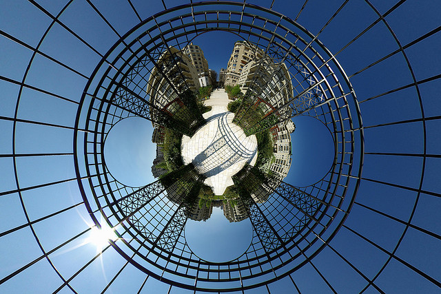

 Dieser Artikel stellt die Bachelorarbeit (Bachelor-Thesis) "Nachhaltige Stadtentwicklung und Freiraummanagement" von [Sabine Ott](/ueber-uns/team/sabine-ott/) aus ihrem Studium "Bachelor of Science in Umweltingenierwesen" mit Vertiefung in "Urbaner Gartenbau" vor. Sie wurde mit dem Prädikat *gut bis hervorragend* bewertet und kann im [Volltext (PDF)](Nachhaltige-Stadtentwicklung-und-Freiraummanagement-Ott-Sabine-Bachelor-Thesis.pdf) heruntergeladen werden.

Nachfolgend gibt das Abstract einen Überblick über die Arbeit.

##Abstract
In unseren Städten verstecken sich unzählige Möglichkeiten mit immensem Potential für eine nachhaltige Entwicklung.

Eine Stadt besteht nicht nur aus der Summe ihrer konventionell genutzten Flächen, sondern auch aus Flächen wie Fassaden oder Abstandsgrün, die unbedingt neu einer erweiterten, nachhaltigen Entwicklung zugeführt werden sollten. Das uns bisher vertraute Alltagsleben kann ferner durch die bewusste, möglicherweise ungewohnte Nutzung dieser Flächen eine neue Dimension erreichen.

Der vorliegende Text ist in zwei Bereiche aufgeteilt; in einen Theorieteil und einen Massnahmenteil. Beide Teile basieren auf einer breit abgestützten Literaturrecherche.

Der Theorieteil bildet die Grundlage der Arbeit, um sich dem weiten Themengebiet der Nachhaltigen Stadtentwicklung und Freiraummanagement anzunähern. Beginnend mit Erklärungen der zentralen Begriffe (wie Freiraum, Management und nachhaltige Entwicklung) führt der Text dieses ersten Teiles weiter zu verschiedenen Aspekten und Anforderungen einer nachhaltigen Stadtorganisation, um danach die Potentiale des Management von Grünräumen anhand der drei Säulen der Nachhaltigkeit (ökologische, ökonomische und soziale Aspekte) darzulegen.

Die im Theorieteil gesammelten Informationen werden im Massnahmenteil mit dem Landschaftsentwicklungs-Werkzeug LEK (Landschaftsentwicklungskonzept) - eine von vielen anwendungsbezogenen Nachhaltigkeitsstrategien - verknüpft. Dies verdeutlicht dessen Potential, die nachhaltige Stadtentwicklung und entsprechendes Freiraummanagement zu fördern. Dieses Potential und der zumeist auf eher wissenschaftlicher Ebene geführte Nachhaltigkeits-Diskurs wird zum Schluss der Arbeit mittels des LEK-Massnahmenkataloges auf das Level von konkreten, primär auf den Grünraum von Wohngebieten fokussierte Massnahmen gebracht.

Durch diese Arbeit wird deutlich, welche Schlüsselrolle einerseits Grünräume, andererseits die Bevölkerung einer Stadt bei der Entwicklung und Stützung von nachhaltigen Strukturen spielen.

## Tags / Schlagworte
Freiraummanagement, Nachhaltige Stadtentwicklung, Grünräume, Nachhaltige Entwicklung, Städtische Leitbilder

##Abstract in English
An uncountable number of possibilities with an enormous potential for sustainable development is hidden in our cities.

A city does not only consist of the sum of its conventional used amenity areas, it also includes areas which should necessarily get (re-)directed to an enhanced and sustainable development, such as facades or buffer strips. The everyday life might furthermore reach a new dimension, caused by an aware, possibly unfamiliar usage of these areas.

This text is split in two sectors; in a theoretical one and one with actions to be taken. Both parts rely on a broad-based literature research.

The theoretical part forms the basis of this paper to bring the reader closer to the wide issue-area of sustainable urban development and the management of greeen open spaces. It starts with explanations of the central terms (as free open space, management and sustainable development) and leads to the different aspects and requirements of a sustainable urban organisation to elaborate the potential of management of green spaces which equally respects the he three pillars - economic, social and environmental - of sustainable development.

On the measure-part of the lecture, the theoretical informations get linked with an environmental development tool (LEK) - one of several application related sustainability strategies. This shall highlight its potential to promote sustainable urban development and an according open-space mnagement. Finally, this potential and the still primarily scientific debate on sustainability are taken to the level of concrete, mainly on green spaces focused measures.

Through this paper it becomes apparent that green spaces on the one hand and the population of a city on the other play a key role in sustaining and reinforcing sustainable structures.