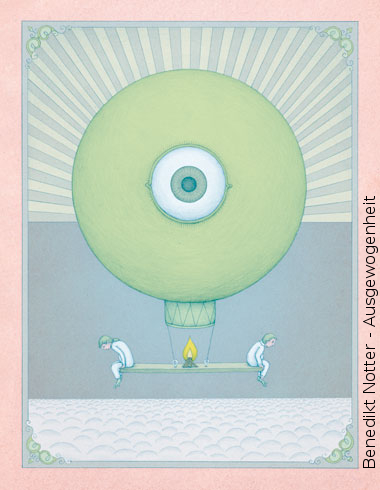

 Dieser Artikel stellt die Bachelorarbeit (Bachelor-Thesis) "Suffizienzstrategie als Weg zur nachhaltigen Entwicklung" von Roger Schärer aus seinem Studium "Bachelor of Science in Umweltingenierwesen" vor. Sie wurde mit dem Prädikat *gut bis hervorragend* bewertet und kann im [Volltext (PDF)](Suffizienzstrategie-als-Weg-zur-nachhaltigen-Entwicklung-Schaerer-Roger-Bachelor-Thesis.pdf) heruntergeladen werden.

Nachfolgend gibt das Abstract einen Überblick über die Arbeit. Die im Kolloquium gezeigte [Präsentation (PDF)](Suffizienzstrategie-als-Weg-zur-nachhaltigen-Entwicklung-Schaerer-Roger-Abschlusspraesentation.pdf) bietet eine erweiterte Einsicht.

##Abstract
Um einen Übergang hin zur nachhaltigen Entwicklung zu erreichen, werden seit den 1970er Jahren als drei zentrale Denk- und Strategieansätze die Effizienz-, Konsistenz- und Suffizienzstrategie vorgebracht. Die letztgenannte scheint dabei die am schwierigsten in der Praxis umsetzbare Strategie zu sein, weil in der Öffentlichkeit bis heute kein Konsens über ihren Stellenwert herbeiführbar ist.

Aufgezeigt wird, ob a) Suffizienzstrategien in der Praxis von Individuen nötig und lebbar sind und b) wie gelebte Suffizienz anhand der Methodik des Erfahrungslernens in der Gesellschaft gefördert werden kann.

Dazu wurde a) eine Literaturrecherche durchgeführt und b) ein Bildungskonzept entwickelt.

Die drei komplementären Strategieansätze wurden einander gegenübergestellt und es wurde dargelegt, dass eine auf Nachhaltigkeit basierende Gesellschaft einer systematischen Umsetzung aller drei Strategien bedarf.

Bei Individuen wird die Suffizienzstrategie benötigt, weil sie auf der Nachfrageseite ansetzt, indem sie das Konsum- und Nutzerverhalten sowie Wertvorstellungen und Bedürfnisse anspricht.

Die vier grundlegenden Suffizienzstrategien (4E’s) Entrümpelung, Entschleunigung, Entkommerzialisierung und Entflechtung, wurden ausgeleuchtet und wurden als Kriterienkatalog für praktische Suffizienzansätze herangezogen.

Exemplarisch wurden <a href="#praktischeansaetze">59 praktisch lebbare Ansätze</a> vorgestellt, welche jeweils mindestens eine der 4E-Strategien verfolgen.

Die Entwicklung des Bildungskonzepts wurde anhand den didaktischen Prinzipien des erfahrungsbasierten Lernens, der Erlebnisorientierung im Handlungsfeld Stadt, des mehrphasigen Lernens und modellhaften Lernens vorgenommen. Es verfolgte als Bildungsziel, die Teilnehmenden in die Lage zu versetzen, einen persönlichen Lebensbereich mittels gezielter Anwendung einer oder mehrerer der 4E’s lustvoller zu gestalten und dadurch motiviert zu sein, in anderen Lebensbereichen die bestehende Balance zwischen Genuss und Überkonsum zu hinterfragen und neu zu tarieren.

<a name="praktischeansaetze"><h2>Praktische Ansätze</h2></a>

Ernährung ⋆ Akzeptanz verminderter optischer und technischer Nahrungsmittelqualität ⋆ Containern ⋆ Eigenanbau ⋆
Fleischarme Ernährung ⋆ Kalorienrestriktion ⋆ Leitungswasser trinken ⋆ Nahrungsmittel-Tauschbörsen ⋆ Nutzung von
bestehenden Kulturen im Wohnumfeld ⋆ Slow Food ⋆ Vertragslandwirtschaft ⋆ Mobilität ⋆ bike to work ⋆ Carpooling
⋆ Carsharing ⋆ Langsamverkehr ⋆ Wohnen und Arbeiten am selben Ort ⋆ Wohnen und Bauen ⋆ Alternative
Zweitwohnungsmodelle ⋆ Autofreies Wohnen ⋆ Minihäuser ⋆ Wohngemeinschaft ⋆ Arbeit ⋆ Arbeit gegen Naturalien
oder Gutscheine ⋆ Arbeitszeitreduktion statt Lohnerhöhung ⋆ Teilzeitarbeit ⋆ Immaterielle Befriedigung statt Lohn ⋆
Konsum und Beschaffung ⋆ Besitzreduktion ⋆ Bring- und Holmarkt ⋆ Brockenhaus ⋆ Buy Nothing Day ⋆
Flohmarkt ⋆ Gemeinschaftlicher Konsum ⋆ Internetauktion ⋆ Kleidung ⋆ Online-Leihbörse ⋆ Peer-Produktion ⋆ Tauschring
⋆ Selbermachen ⋆ Swapping Days ⋆ Freizeitbeschäftigung ⋆ Couchsurfing ⋆ Musse ⋆ Privatwohnungsmiete ⋆
Sport ⋆ Geist ⋆ Ausklinken ⋆ Meditation ⋆ Nichts Denken ⋆ Schlaf ⋆ Zen ⋆ Kommunikation
⋆ Medienkonsum ⋆ Werbung ⋆ Geld ⋆ Abstinenz ⋆ Crowdfunding ⋆ Regiogeld ⋆ Sprache und
Schrift ⋆ Kleinschreibung ⋆ Toki Pona ⋆ Bestehende Bildungsangebote ⋆ Lessnesslive ⋆
Outdoor Education ⋆ Diverses ⋆ Forschung und Wissenschaft ⋆ Fortpflanzung ⋆ Hierarchie ⋆ Software ⋆
Wahlmöglichkeiten

## Tags / Schlagworte
4E, Bachelorarbeit, Beispiele, Bidlungskonzept, Entflechtung, Entkommerzialisierung, Entrümpelung, Entschleunigung, Erfahrungslernen, Praxis, Suffizienz, Suffizienz, Theorie, Umweltbildung, nachhaltige Entwicklung, wissenschatliche Arbeit

## Leadimage Quelle
Das Leadimage mit dem Titel Ausgewogenheit ist von [Benedikt Notter](http://www.benediktnotter.ch/).